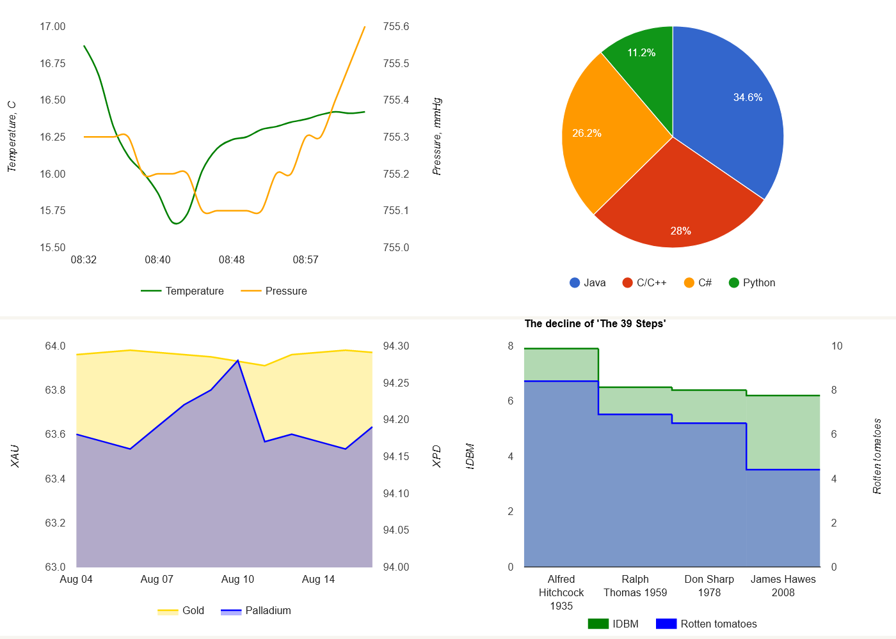

# GoogleCharts library



## Library methods:
```C++
GoogleCharts newDataChart(uint16_t points, bool extraData);
```
creating an object of the class 
(`points` - the number of points of reference in the stack (FIFO), `extraData` - using an additional data column (by default `false`)).
____
```C++
void GoogleCharts.push(uint64_t / String X, float A, float B);
```
add a row of data to the stack 
(`X` - 1 column of data, `A` - 2 column of data, `B` - 3 column of data (optional with `extraData = true`)).
____
```C++
void GoogleCharts.setLegendIntervale (uint8_t intervale);
```
label interval for x-axis values.
____
```C++
void GoogleCharts.setMinValue(bool useMinValue, int minValueA,  int minValueB);
```
using minimum values ​​for plotting charts 
(useMinValue turns on the function, minValueA is the minimum value for the first chart, minValueB is the minimum value for the second chart (if `extraData = true`)).
____
```C++
void GoogleCharts.setCurveFunction(bool curveFunction);
```
graph smoothing, works only with Line Charts.
____
```C++
void GoogleCharts.setDateFormat(bool useDateFormat, String dateFormat);
```
use time formatting with preset 
(default `"HH: mm"`), can be used to format unix epoch time.
____
```C++
void GoogleCharts.setLeftStyle(String label, String title, String HTMLcolor);
```
setting the style of the left Y-axis.
____
```C++
void GoogleCharts.setRightStyle(String label, String title, String HTMLcolor);
```
setting the style of the right Y-axis.
____
```C++
void GoogleCharts.setHorizontalTitle(String title);
```
top caption for Google Charts.
____
```C++
void GoogleCharts.setHorizontalLabel(String label);
```
X chart column name.
____
```C++
bool GoogleCharts.ready();
```
returns bool `true` if the stack has data to display, bool false if the stack is empty.
____
```C++
String GoogleCharts.getCharts(uint8_t type, uint16_t width, uint16_t height);
```
returns a string to be embedded in an HTML form (type - visualization type 
(0 - Line Chart, 1 - Pie Chart, 2 - Area Chart, 3 - Stepped Area Chart), 
width - render width (pixels), 
height - render height (pixels)).
____